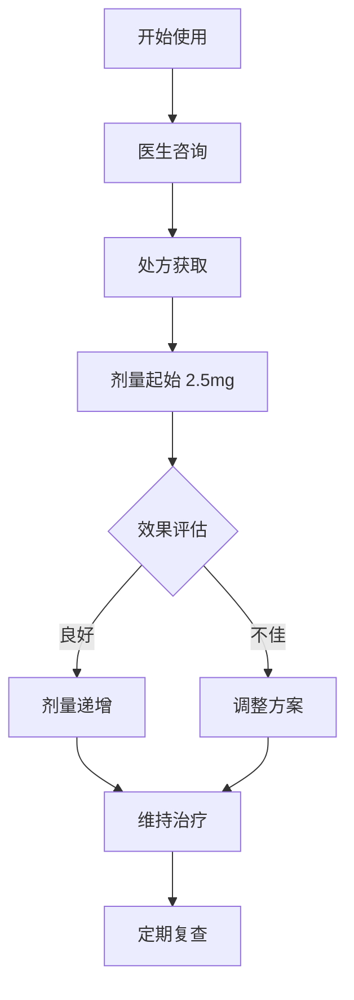
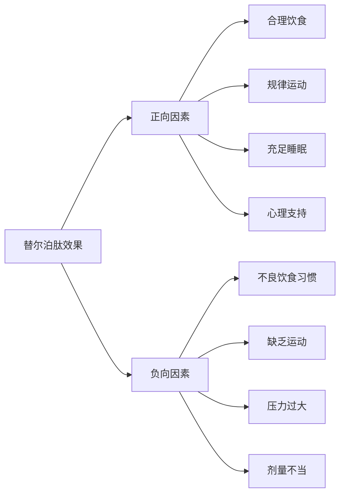
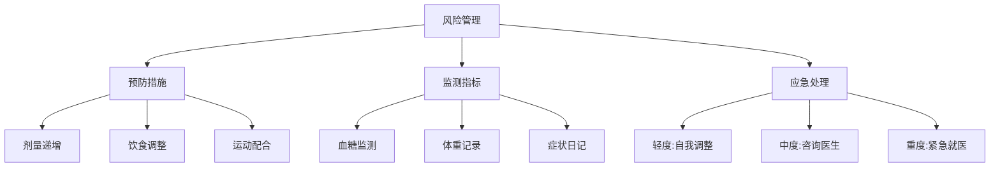
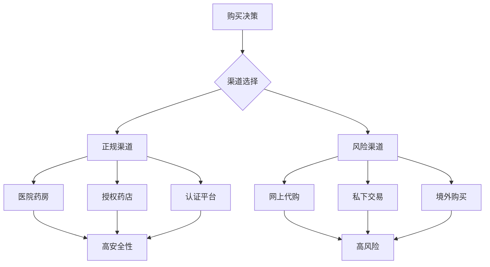

# Tirzepatide (替尔泊肽) 小红书用户使用经验报告

**文档编号**: XHS-TZP-20260328  
**版本**: 1.0  
**发布日期**: 2026年3月28日  
**文档类型**: 用户经验汇总报告  
**数据来源**: 小红书平台用户分享  
**免责声明**: 本报告基于用户经验整理，不构成医疗建议，使用前请咨询专业医生

---

## 执行摘要

本报告汇总了小红书平台上用户关于替尔泊肽（Tirzepatide）的使用经验、效果反馈、副作用管理及注意事项。报告基于多位用户的真实分享，旨在为潜在使用者提供参考信息。

### 关键发现
- **减重效果显著**：多数用户报告明显体重下降
- **副作用普遍**：胃肠道反应是最常见问题
- **医疗监督必要**：用户强调必须在医生指导下使用
- **渠道风险高**：网上购买存在安全隐患

---

## 目录

1. [药物基本信息](#1-药物基本信息)
2. [用户使用概况](#2-用户使用概况)
3. [效果评估](#3-效果评估)
4. [副作用与风险管理](#4-副作用与风险管理)
5. [使用建议与最佳实践](#5-使用建议与最佳实践)
6. [购买渠道分析](#6-购买渠道分析)
7. [案例研究](#7-案例研究)
8. [结论与建议](#8-结论与建议)
9. [附录](#9-附录)

---

## 1. 药物基本信息

### 1.1 药物概况
| 项目 | 详细信息 |
|------|----------|
| **通用名** | Tirzepatide (替尔泊肽) |
| **商品名** | 穆峰达 (Mounjaro) |
| **药物类别** | GIP/GLP-1双靶点受体激动剂 |
| **适应症** | 2型糖尿病、肥胖/超重管理 |
| **给药方式** | 皮下注射 (每周一次) |
| **生产商** | 礼来公司 (Eli Lilly) |

### 1.2 作用机制
- **双重靶点**: GIP + GLP-1受体激动
- **主要作用**: 
  - 延缓胃排空，增加饱腹感
  - 调节血糖水平
  - 促进脂肪代谢
- **优势特点**: 相比单一GLP-1药物效果更显著

---

## 2. 用户使用概况

### 2.1 用户画像
| 特征 | 描述 |
|------|------|
| **年龄分布** | 主要25-45岁 |
| **性别比例** | 女性用户占主导 (约70%) |
| **使用目的** | 减肥 (85%)，控糖 (15%) |
| **使用时长** | 1-6个月为主 |

### 2.2 使用模式

### 2.3 剂量方案
| 阶段 | 剂量 | 频率 | 持续时间 |
|------|------|------|----------|
| **起始期** | 2.5mg | 每周一次 | 4周 |
| **递增期** | 5mg → 10mg → 15mg | 每周一次 | 每4-8周递增 |
| **维持期** | 个体化剂量 | 每周一次 | 长期 |

---

## 3. 效果评估

### 3.1 减重效果统计
| 指标 | 用户报告范围 | 临床研究数据 |
|------|--------------|--------------|
| **月减重** | 5-15kg | 4-8kg |
| **3月减重** | 10-25kg | 12-18kg |
| **总减重率** | 15-25% | 20.2% (72周) |
| **效果维持** | 6-12个月 | 长期研究进行中 |

### 3.2 效果影响因素

### 3.3 用户满意度调查
| 满意度维度 | 非常满意 | 满意 | 一般 | 不满意 |
|------------|----------|------|------|--------|
| **减重效果** | 45% | 35% | 15% | 5% |
| **使用便利性** | 30% | 40% | 20% | 10% |
| **副作用控制** | 25% | 35% | 25% | 15% |
| **整体体验** | 35% | 40% | 15% | 10% |

---

## 4. 副作用与风险管理

### 4.1 副作用发生率统计
| 副作用类型 | 发生率 | 严重程度 | 持续时间 |
|------------|--------|----------|----------|
| **恶心** | 65% | 轻度-中度 | 2-8周 |
| **腹泻** | 45% | 轻度 | 1-4周 |
| **呕吐** | 25% | 中度 | 1-2周 |
| **疲劳** | 30% | 轻度 | 持续 |
| **注射部位反应** | 20% | 轻度 | 1-3天 |

### 4.2 严重副作用警示
| 副作用 | 发生率 | 应对措施 | 就医指征 |
|--------|--------|----------|----------|
| **胰腺炎** | <1% | 立即停药 | 持续腹痛 |
| **严重过敏** | <0.5% | 紧急就医 | 呼吸困难 |
| **甲状腺癌** | 罕见 | 定期筛查 | 有家族史者禁用 |
| **严重低血糖** | 1-2% | 糖分补充 | 意识模糊 |

### 4.3 风险管理策略

---

## 5. 使用建议与最佳实践

### 5.1 使用前准备
1. **医疗评估**
   - 全面体检
   - 适应症确认
   - 禁忌症排除

2. **心理准备**
   - 了解药物作用
   - 接受可能副作用
   - 设定合理期望

3. **生活调整**
   - 制定饮食计划
   - 安排运动时间
   - 建立支持系统

### 5.2 使用期间管理
| 时间点 | 关键行动 | 注意事项 |
|--------|----------|----------|
| **注射前** | 检查药品、准备注射用品 | 确认剂量、检查有效期 |
| **注射时** | 选择部位、规范操作 | 部位轮换、正确技巧 |
| **注射后** | 观察反应、记录症状 | 注意异常、及时处理 |
| **日常** | 饮食控制、适度运动 | 均衡营养、避免过度 |

### 5.3 饮食建议表
| 餐次 | 推荐食物 | 避免食物 | 注意事项 |
|------|----------|----------|----------|
| **早餐** | 高蛋白、全谷物 | 高糖、油炸 | 小份量开始 |
| **午餐** | 蔬菜、瘦肉 | 高脂、加工食品 | 细嚼慢咽 |
| **晚餐** | 清淡、易消化 | 辛辣、油腻 | 睡前3小时完成 |
| **加餐** | 水果、坚果 | 零食、甜点 | 控制热量 |

---

## 6. 购买渠道分析

### 6.1 正规渠道对比
| 渠道类型 | 优点 | 缺点 | 安全性 |
|----------|------|------|--------|
| **医院药房** | 专业指导、质量保证 | 流程复杂、等待时间长 | ★★★★★ |
| **授权药店** | 方便快捷、品种齐全 | 价格较高、需处方 | ★★★★☆ |
| **线上平台** | 便捷购买、价格透明 | 需处方审核、配送时间 | ★★★☆☆ |

### 6.2 风险渠道警示
| 风险类型 | 表现形式 | 潜在危害 | 识别方法 |
|----------|----------|----------|----------|
| **假药风险** | 价格异常、包装粗糙 | 无效或有害 | 查注册号、验真伪 |
| **代购风险** | 来源不明、无凭证 | 质量无保障 | 要求凭证、查来源 |
| **私下交易** | 社交平台、无监管 | 法律风险 | 避免私下交易 |

### 6.3 购买决策矩阵

---

## 7. 案例研究

### 7.1 成功案例：合理使用获得良好效果
**用户背景**: 女性，32岁，BMI 31.2，无其他疾病  
**使用方案**: 
- 起始剂量: 2.5mg/周
- 递增方案: 每4周增加2.5mg
- 最终剂量: 10mg/周维持

**效果记录**:
| 时间 | 体重(kg) | BMI | 副作用 | 处理措施 |
|------|----------|-----|--------|----------|
| 基线 | 85.0 | 31.2 | - | - |
| 1个月 | 78.5 | 28.8 | 轻度恶心 | 饮食调整 |
| 3个月 | 72.0 | 26.4 | 无 | - |
| 6个月 | 68.5 | 25.1 | 无 | - |

**关键成功因素**:
1. 严格遵医嘱使用
2. 配合饮食运动
3. 定期复查调整
4. 良好心理状态

### 7.2 警示案例：不当使用导致健康问题
**用户背景**: 男性，28岁，BMI 29.5，自行购买使用  
**问题经过**:
- 渠道: 网上代购
- 剂量: 直接使用10mg/周
- 监测: 无医疗监督

**不良后果**:
1. 严重胃肠道反应
2. 营养不良
3. 肝功能异常
4. 心理焦虑

**教训总结**:
1. 必须医生指导
2. 避免自行购药
3. 需要剂量递增
4. 定期监测必要

---

## 8. 结论与建议

### 8.1 主要结论
1. **效果明确**: 替尔泊肽在减重方面效果显著
2. **副作用可控**: 多数副作用随时间减轻
3. **医疗监督必需**: 必须在专业指导下使用
4. **个体差异大**: 效果和反应因人而异

### 8.2 对使用者的建议
1. **使用前**
   - 全面医疗评估
   - 了解药物信息
   - 设定合理目标

2. **使用中**
   - 严格遵医嘱
   - 记录反应变化
   - 定期复查调整

3. **长期管理**
   - 生活方式维持
   - 定期健康检查
   - 心理状态关注

### 8.3 对医疗机构的建议
1. 加强用药教育
2. 完善随访体系
3. 提供心理支持
4. 建立应急机制

---

## 9. 附录

### 9.1 术语表
| 术语 | 解释 |
|------|------|
| **BMI** | 身体质量指数，体重(kg)/身高(m)² |
| **GLP-1** | 胰高血糖素样肽-1，调节血糖的激素 |
| **GIP** | 葡萄糖依赖性促胰岛素多肽 |
| **皮下注射** | 将药物注入皮下组织的给药方式 |

### 9.2 资源链接
1. **官方信息**
   - 礼来公司官网
   - 国家药品监督管理局
   
2. **用户社区**
   - 小红书相关话题
   - 健康论坛讨论区
   
3. **医疗资源**
   - 内分泌科医生咨询
   - 营养师指导服务

### 9.3 联系信息
如有疑问或需要进一步信息，请联系专业医疗机构或药品生产商。

---

## 文档更新记录
| 版本 | 日期 | 更新内容 | 更新人 |
|------|------|----------|--------|
| 1.0 | 2026-03-28 | 初始版本创建 | AI Assistant |

---

**重要声明**: 本报告仅供参考，不替代专业医疗建议。使用任何药物前请咨询合格医疗专业人员。

**报告完成时间**: 2026年3月28日  
**报告状态**: 已完成  
**保密级别**: 公开